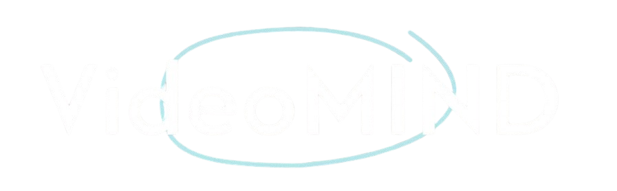

# VideoMind

<p align="center">
  
</p>

**Your Videos, Organized by AI.**

VideoMind is an AI-powered platform that transforms raw video content into searchable chapters, concise summaries, and context-grounded answers. It leverages advanced LLMs, retrieval-augmented generation, and multi-vector retrieval to help you find exactly what you need in seconds—no more scrubbing through hours of footage.

---

## Table of Contents

- [Features](#features)
- [Tech Stack](#tech-stack)
- [Project Structure](#project-structure)
- [LangGraph Agent & Retrieval Techniques](#langgraph-agent--retrieval-techniques)
- [How It Works](#how-it-works)
- [Getting Started](#getting-started)
- [License](#license)

---

## Features

- **Automatic Video Segmentation:** Upload a video or paste a link; VideoMind transcribes and segments it into logical, thematic chapters.
- **Deep Summarization:** Each section is summarized with key topics, timestamps, and people/entities involved.
- **Interactive Chat:** Ask questions about the video or specific sections; get context-grounded answers with sources.
- **Multi-Provider LLM Support:** Choose between OpenAI (GPT-4o) and Google Gemini for processing and chat.
- **Retrieval-Augmented Generation (RAG):** Combines vector search, semantic search, and QA-pair retrieval for high-precision answers.
- **User Dashboard:** Manage video history, review chapters, and chat interactively.
- **Authentication:** Secure login/signup with Supabase and Google OAuth.
- **Modern UI:** Built with React, TailwindCSS, and Framer Motion for a beautiful, responsive experience.

---

## Tech Stack

**Frontend:**

- React 19
- Vite
- TailwindCSS
- Framer Motion
- Supabase Auth
- Lucide Icons

**Backend:**

- FastAPI (Python 3.13)
- LangChain, LangGraph
- OpenAI & Gemini LLMs
- Pinecone (vector DB)
- Redis (caching, docstore)
- Supabase (metadata, history)

**Other:**

- Docker-ready
- Environment config via `.env`

---

## Project Structure

```
videoMind/
├── backend/
│   ├── app/
│   │   ├── main.py                # FastAPI entrypoint
│   │   ├── models/                # Pydantic schemas
│   │   ├── routes/                # API endpoints (chat, process, settings)
│   │   └── services/              # Core logic: RAG, LangGraph, retrieval, etc.
│   └── requirements.txt           # Python dependencies
├── frontend/
│   ├── src/
│   │   ├── App.jsx                # Main React app
│   │   ├── components/            # UI components (Dashboard, Auth, Landing, etc.)
│   │   └── lib/                   # Context, utils, Supabase client
│   ├── resource/logo.png          # Project logo
│   ├── index.html, index.css      # Entry and styles
│   └── package.json               # Frontend dependencies
└── supabase/
    └── schema.sql                 # DB schema
```

---

## LangGraph Agent & Retrieval Techniques

### LangGraph Agent

- **LangGraphChatbotService** orchestrates the chat workflow using a state graph (via LangGraph).
- Dynamically routes user queries to either generic LLM chat or video-grounded retrieval.
- Maintains conversation history and context for continuity.

### Retrieval Techniques

- **Multi-Vector Retriever:**
  - Uses Pinecone for dense vector search and Redis for docstore.
  - Indexes summaries, transcripts, and QA pairs for each section.
- **RAG Pipeline:**
  - Segments video into chapters, generates summaries, and creates QA pairs for better recall.
  - Supports both OpenAI and Gemini embeddings/models.
- **Cache Layer:**
  - Redis-based cache for fast repeated queries.
- **Section/Video Context:**
  - Answers can be grounded in a specific section or the whole video.

---

## How It Works

1. **Upload:** Drop a video file or paste a YouTube link. VideoMind fetches and transcribes the content.
2. **Analyze:** The backend segments the transcript into thematic chapters, summarizes each, and generates QA pairs.
3. **Review & Chat:**
   - Browse chapters, jump to timestamps, and see key topics.
   - Ask questions about the video or a specific section; get answers with sources and context.

---

## Clone & Run Locally

```bash
git clone https://github.com/yashthakur-01/videoMind.git
cd videoMind
# Backend setup
cd backend
python -m venv myenv
source myenv/bin/activate  # or myenv\Scripts\activate on Windows
pip install -r requirements.txt
uvicorn app.main:app --reload
# In a new terminal, start the frontend
cd ../frontend
npm install
npm run dev
```

---

## Getting Started

### Prerequisites

- Python 3.13+
- Node.js 18+
- Redis, Pinecone, Supabase account
- OpenAI and/or Gemini API keys

### Backend

```bash
cd backend
python -m venv myenv
source myenv/bin/activate  # or myenv\Scripts\activate on Windows
pip install -r requirements.txt
uvicorn app.main:app --reload
```

### Frontend

```bash
cd frontend
npm install
npm run dev
```

### Environment

- Copy `.env.example` to `.env` in both backend and frontend, and fill in your API keys and DB URLs.

---

<p align="center">
  <b>Transform raw video into searchable chapters, concise summaries, and context-grounded answers.</b>
</p>
